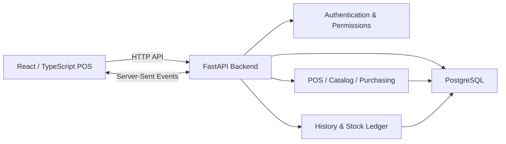

# POS — Real-Time Inventory Point of Sale

A web-based Point-of-Sale (POS) and inventory management system for a grocery store / mart.

The system is designed around one central idea: **sales, stock, purchasing, refunds, expenses, user actions, and reporting all stay connected to the same live inventory and audit trail.**

It runs locally and uses a **React + TypeScript** frontend, a **Python + FastAPI** backend, and **PostgreSQL** for persistent data.

---

## Product Overview

This POS is more than a checkout screen. It covers the main operational flow of a small retail store:

**Sell → Inventory changes → Purchase/receive stock → Track every movement → Manage invoices/refunds → Record expenses → Review reports → Audit user activity**

The application keeps these areas connected so that a stock change made in one part of the system is reflected in the relevant inventory, movement history, invoices, and reporting views.

---

## Main Capabilities

### 🛒 Point of Sale / Selling

The selling screen is the main operational workspace.

- Products can be found by **barcode/SKU** or by searching their name.
- Products can be sold as whole units or as **weighed quantities** such as kg/litre, with up to 3 decimal places.
- Inventory is deducted **when an item is added to the cart**, rather than waiting until the final checkout.
- Removing an item or clearing the cart returns the reserved stock.
- The cart supports item quantities, live pricing and totals.
- Checkout supports:
  - Cash
  - Card
  - Wallet
- Tax is applied to the sale and discount codes can be used where permitted.
- The receipt records the person who served the customer.
- Refunds can be performed per item or partially, with the corresponding stock restored.

This makes the POS screen directly connected to inventory rather than treating sales and stock as separate systems.

### 📦 Real-Time Inventory

Inventory is handled through a central stock-change flow.

Every stock change records:

- What changed
- Previous quantity
- New quantity
- Reason/type of movement
- User responsible
- Related business action

Examples of stock movements include:

- Sale / scan
- Cart removal / void
- Purchase receiving
- Manual stock adjustment
- Refund

The application prevents stock from becoming negative through application-level checks as well as a database constraint.

The frontend also receives live updates through **Server-Sent Events (SSE)** so open screens can reflect inventory changes without manually refreshing.

### 🏷️ Product Catalog

The Catalog section manages the products available to the POS.

It supports:

- Adding products
- Editing product information
- Product price and cost
- Live margin calculation
- Below-cost warnings
- Product activation/deactivation
- Immutable barcode/SKU
- Product price history

Price changes are treated as controlled actions and can require manager/owner approval depending on the user's role.

### 🚚 Purchasing & Stock Receiving

The purchasing workflow connects supplier purchasing directly to inventory.

It covers:

- Suppliers
- Purchase orders
- Creating purchase orders
- Cancelling/closing purchase orders
- Receiving stock, including partial receiving
- Barcode-based receiving
- Recording purchases as paid/unpaid
- Supplier balances
- Purchase reporting

When stock is received, inventory is increased through the same controlled stock movement system used by the POS.

This keeps the relationship between **what was purchased, what was received, and what is currently in stock** traceable.

### 🧾 Invoices & Refunds

Sales are retained as invoices that can be reviewed after checkout.

The invoice workflow supports:

- Viewing completed sales
- Reviewing line items
- Tracking quantities and totals
- Partial refunds
- Per-item refunds
- Restoring refunded quantities to inventory

Refunds are also reflected in the audit/history trail so the original sale and subsequent adjustment remain traceable.

### 💰 Expenses & Reports

Managers can record operating expenses and review business activity through the reporting area.

The reports cover information such as:

- Net sales
- Refunds
- Purchases
- Expenses
- Cash flow
- Unpaid supplier amounts
- Top-selling products

Expenses are not silently deleted. A voided expense remains part of the operational history together with the reason for the void.

### 🕵️ History / Audit Log

The History section provides an audit trail of business activity.

Business events are recorded in the same transaction as the underlying change, so the system can connect an action with the data change it caused.

History can be filtered by:

- Event type
- Text
- Date

The audit information identifies the person who performed the action and, where approval was required, the approving user as well.

The history and stock ledgers are designed to be **append-only**, which helps preserve an operational record rather than allowing business events to simply disappear.

---

## User Roles & Access Control

The system has three application roles:

| Role | Access |
|---|---|
| **Cashier** | Selling, products/stock visibility, invoices, stock movements and own account |
| **Manager** | Cashier capabilities plus Catalog, Purchasing, Suppliers, Expenses, Reports and History |
| **Owner** | Manager capabilities plus user management and Security |

The interface hides sections a role cannot use, while the backend enforces the same permissions.

This means access control is not dependent only on what is visible in the frontend.

### Manager Approval

Sensitive actions can require a manager or owner to approve the action directly from the cashier's screen.

Approval can be required for actions such as:

- Refunds
- Stock adjustments
- Discount codes
- Product price/cost changes
- Receiving stock
- Purchase-order cancellation/closing
- Marking purchases as paid
- Voiding expenses
- User-management operations

The approval is recorded in History so both the acting user and approving user remain identifiable.

---

## Authentication & Security

The application provides individual user accounts instead of a shared POS login.

Security functionality includes:

- Username/password authentication
- Personal PINs
- Role-based permissions
- Sensitive-action approval
- Account lockouts
- PIN lockouts
- Session expiration
- Owner-controlled user management
- Account unlocking
- Password/PIN reset support
- Central permission policy for API routes

The permission policy is centralized in the backend. The application checks that every route has a permission rule and refuses to start if the policy is incomplete.

PINs are not stored as plain text. They use a salted `scrypt` derivation with a secret key.

---

## How the System Works

The application follows a clear separation between the UI, API/business logic and database.



### Typical Sale Flow

```text
Product scan/search
        ↓
Product + quantity added to cart
        ↓
Available stock checked
        ↓
Stock reserved/deducted
        ↓
Cart can be changed
        ↓
Removed items return to stock
        ↓
Checkout
        ↓
Invoice created
        ↓
History/audit event recorded
        ↓
Reports and invoice data updated
```

### Typical Purchase Flow

```text
Supplier
   ↓
Purchase Order
   ↓
Order items
   ↓
Partial/full receiving
   ↓
Stock increases
   ↓
Stock movement recorded
   ↓
Purchase recorded as paid/unpaid
   ↓
Purchasing reports updated
```

### Refund Flow

```text
Existing Invoice
      ↓
Select item/quantity to refund
      ↓
Approval when required
      ↓
Refund recorded
      ↓
Inventory restored
      ↓
History updated
```

---

## Live Inventory & Audit Model

One of the important design choices is that stock changes are not scattered across unrelated parts of the application.

The system uses a central stock movement model so actions such as selling, receiving, adjusting and refunding can be traced consistently.

Conceptually:

```text
Business Action
      ↓
Stock Change
      ↓
Before / After Quantity
      ↓
Movement Ledger
      ↓
History / Audit Event
```

This gives the system a traceable relationship between an operational action and the inventory change it produced.

---

## Database

PostgreSQL is used as the primary database.

The database stores the application's operational data, including:

- Users and roles
- Products
- Inventory
- Sales/invoices
- Cart state
- Stock movements
- Purchase orders
- Suppliers
- Purchases
- Expenses
- History/audit events
- Product price history

The backend uses transactions for business operations so related changes can be committed together.

A restricted application database login can also be configured so the POS application itself cannot modify or delete protected history/ledger data.

---

## Screenshots

The following screenshots show the current application flow and major areas of the POS.

### Point of Sale

| Dashboard | Cart / Sale |
|---|---|
|  |  |

| Payment / Cart | Weighted Item |
|---|---|
|  |  |

| Search / Item Selection | Checkout |
|---|---|
|  |  |

### Inventory

| Inventory | Low Stock |
|---|---|
|  |  |

| Stock Warning | Stock Movements |
|---|---|
|  |  |

### Catalog

| Catalog | Product Editing |
|---|---|
|  |  |

| Product Form | Updated Catalog |
|---|---|
|  |  |

### Purchasing

| Purchase Orders | Create Purchase Order |
|---|---|
|  |  |

| Purchase Order List | Receiving |
|---|---|
|  |  |

### Approval, Invoices & Reporting

| Manager Approval | Purchasing History |
|---|---|
|  |  |

| Invoices | Invoice / Refund |
|---|---|
|  |  |

| Expenses & Reports | Reports |
|---|---|
|  |  |

### Audit & Security

| History | Security |
|---|---|
|  |  |

---

## Technology Stack

### Frontend

- React
- TypeScript
- Vite
- CSS
- Server communication through the backend API
- Server-Sent Events for live updates

### Backend

- Python
- FastAPI
- PostgreSQL database integration
- Transaction-based business operations
- Authentication and authorization
- Audit/history recording

### Testing

The project includes backend test suites covering:

- POS/business flows
- Selling
- Refunds
- Purchasing
- History
- Concurrency
- Authentication
- Roles and permissions
- PIN approval
- Lockouts
- Sessions
- CORS
- Restricted database access

There is also a simulated-browser UI click-through covering the main user interface flows.

---

## Local Setup

The application is intended to run locally.

### Requirements

- Python
- Node.js / npm
- PostgreSQL

Docker can also be used for the PostgreSQL database.

### Database

Create the PostgreSQL database and application user, then configure the backend environment using:

```text
backend/.env.example
```

The main application database URL is configured through:

```text
DATABASE_URL
```

The default shop timezone is:

```text
Asia/Karachi
```

### First Run

On the first launch, the application provides a first-time setup flow to create the initial owner account.

After that, the owner can create the required manager and cashier accounts through the Security section.

---

## Backups & Data Migration

The project includes database backup and migration functionality.

### Backups

The backup system supports:

- PostgreSQL dumps
- Verification after backup creation
- Retention of recent backups
- Scheduled daily backups
- Restore from a database dump

The application secret used for PIN protection is kept separately from the database backup and should be backed up separately as well.

### SQLite → PostgreSQL Migration

An existing SQLite database can be migrated to PostgreSQL.

The migration process is designed to preserve IDs and historical information and then verify:

- Row counts
- Money totals
- Stock ledger consistency

A dry-run mode is available before applying the migration.

---

## API Structure

The backend exposes REST-style API routes grouped by business area.

| Area | Examples |
|---|---|
| Authentication | `/auth/status`, `/auth/setup`, `/auth/login`, `/auth/logout` |
| Users & Security | `/users`, `/users/{id}/update`, `/security/policy` |
| Selling | `/inventory`, `/scan`, `/cart`, `/checkout`, `/sales`, `/movements` |
| Catalog | `/catalog/meta`, `/catalog/products`, `/catalog/products/{id}/update` |
| Purchasing | `/suppliers`, `/purchase-orders`, `/purchases`, `/expenses`, `/reports/purchases` |
| History | `/history`, `/history/meta` |

All protected routes require authentication, and non-GET requests use the application's request protection header.

---

## Project Structure

```text
pos-fullstack/
├── backend/
│   ├── main.py
│   ├── database.py
│   ├── auth.py
│   ├── catalog.py
│   ├── purchasing.py
│   ├── history.py
│   ├── backup.py
│   ├── secure_db.py
│   ├── init_db.py
│   ├── manage_users.py
│   ├── migrate_sqlite_to_postgres.py
│   └── tests/
│
├── frontend/
│   └── src/
│       ├── App.tsx
│       ├── api.ts
│       ├── auth.tsx
│       ├── CatalogPage.tsx
│       ├── PurchasingPages.tsx
│       ├── HistoryPage.tsx
│       └── SecurityPage.tsx
│
├── docs/
│   └── screenshots/
│
├── tests-ui/
│   └── ui-clickthrough.mjs
│
├── docker-compose.yml
└── README.md
```

---

## Current Implementation

The current implementation provides an end-to-end retail workflow covering:

- POS selling
- Real-time inventory
- Product catalog management
- Purchasing and stock receiving
- Invoices and refunds
- Expenses
- Business reports
- User roles and permissions
- Manager approval
- Authentication and security controls
- Audit/history tracking
- PostgreSQL persistence
- Backup and migration support
- Automated backend/security test coverage
- UI click-through testing

The screenshots above represent the current application interface and workflow.

---

## Notes

The application is currently designed for **local operation**. The existing implementation also documents several operational boundaries, including:

- HTTP is used locally rather than HTTPS.
- The application uses a single backend process because live-update state is maintained in-process.
- Weighed products currently rely on manually entered quantities rather than a hardware scale integration.
- There is one global cart rather than separate carts per till.
- Some store-level settings remain fixed in the current implementation.
- Real-world hardware such as barcode scanners, weighing scales and networked tills requires hardware-specific testing before deployment.

These are implementation boundaries of the current version rather than gaps in the core POS workflow.

---

## Summary

This project provides a complete local POS workflow in which **selling, inventory, purchasing, refunds, expenses, reporting, security and audit history work together around the same underlying data model**.

The result is a system where a retail transaction is not isolated: the sale affects stock, the stock change is recorded, the invoice remains available for review, refunds can restore inventory, purchasing can replenish stock, reports summarize activity, and History provides an audit trail of who performed and approved important actions.
